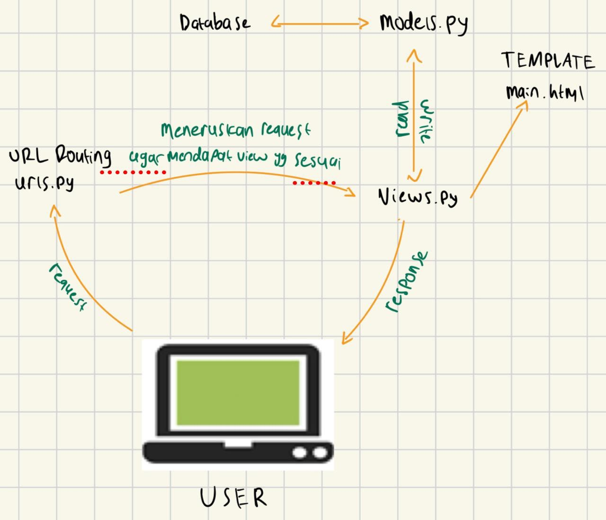

# Aldo's Garage

**Tugas Individu - Kelas B**

> **Aldo's Garage** merupakan suatu website yang menjual berbagai mobil dan dapat dikatakan sebagai e-commerce. Aldo's Garage menjual mobil-mobil vintage dan dapat diakses pada link [ini](http://rogerio-geraldo-aldogarage.pbp.cs.ui.ac.id/).

[Website Aldo's Garage](http://rogerio-geraldo-aldogarage.pbp.cs.ui.ac.id/)

## **Penjelasan**

<details>
<summary> <b> Tugas 2 </b> </summary>

## **Step-step pengerjaan Proyek Aldo's Garage**

* ### Melakukan Inisiasi Project

    Petama-tama saya membuat direktori baru dengan nama aldo-garage, kemudian setelah itu saya membuat file `requirements.txt` yang berisi dependencies dan mengisinya dengan dependencies yang ada.

    Setelah itu saya melakukan instalasi menggunakan virtual environment pada terminal dengan command `pip install -r requirements.txt` lalu membuat proyek Django dengan perintah `django-admin startproject aldo-garage .`

* ### Run Server Django

    Untuk melakukan runserver, saya menambahkan `["localhost", "127.0.0.1"]` pada `ALLOWED_HOSTS` yang ada pada file `setting.py` untuk melakukan deployment kemudian menjalankan server dengan command `python manage.py runserver`

* ### Menginisiasi `main`

    Untuk membuat `main` lakukan command `python manage.py startapp main`, kemudian kita harus menambahkan `main` ke `INSTALLED_APPS` pada file `settings.py`.

    Setelah menginisiasi `main` saya mengubah file `models.py` pada direktori `main` untuk melakukan mendefinisikan model baru dengan class dan fungsi yang ada pada tutorial.

    Setelah itu saya melakukan migrate model baru tersebut dengan command `python manage.py makemigrations` dan `python manage.py migrate`.

* ### Membuat `main.html`

    Mengisi file `main.html` dengan template:

    ```
    <h1>Aldo's Garage</h1>

    <h5>NPM: </h5>
    <p>{{npm}}</p> 

    <h5>Name: </h5>
    <p>{{name}}</p>

    <h5>Class: </h5>
    <p>{{class}}</p> 

    <h5>E-Commerce: </h5>
    <p>{{e-commerce}}</p> 

    <h5>Produk: </h5>
    <p>{{product}}</p>

    <h5>Harga: </h5>
    <p>{{price}}</p> 

    ```

    Kemudian kita juga harus mengisi file `views.py` dengan template function `show_main` yang ada pada file tutorial.

    * ### Routing `main`

    Saya mengatur URL pada aplikasi `main` dengan mengedit file `urls.py` pada folder `main` dengan template:

    ```
    from django.urls import path
    from main.views import show_main

    app_name = 'main'

    urlpatterns = [
        path('', show_main, name='show_main'),
    ]
    ```

Setelah itu kita dapat menjalankan `main` dengan command `python manage.py runserver`

## **Jawaban Tugas 2**

* ### Bagan request client ke web aplikasi berbasis Django



    Dalam alur kerja Django, urls.py bertugas mengatur routing dengan meneruskan request pengguna ke fungsi yang sesuai di views.py. Di views.py, logika aplikasi diimplementasikan, seperti mengambil atau memodifikasi data dari models.py yang terhubung dengan basis data. Data yang diambil kemudian diteruskan ke berkas HTML (template) untuk menghasilkan tampilan yang akan dilihat pengguna. Setelah semua proses selesai, views.py mengembalikan response yang berisi HTML hasil render kepada pengguna, yang kemudian ditampilkan di browser.

* ### Jelaskan fungsi git dalam pengembangan perangkat lunak!


    Git berfungsi sebagai sistem kontrol versi yang membantu pengembang melacak dan mengelola perubahan kode dalam proyek perangkat lunak. Dengan Git, pengembang dapat bekerja secara kolaboratif, membuat cabang (branch) untuk fitur baru, dan menggabungkannya (merge) kembali ke cabang utama setelah diuji. Ini juga memungkinkan rollback ke versi sebelumnya jika terjadi kesalahan, sehingga mempermudah pengelolaan versi dan integritas kode dalam pengembangan perangkat lunak.

* ### Menurut Anda, dari semua framework yang ada, mengapa framework Django dijadikan permulaan pembelajaran pengembangan perangkat lunak?


    Django sering dijadikan permulaan dalam pembelajaran pengembangan perangkat lunak karena beberapa alasan utama. Pertama, Django adalah framework "batteries-included", artinya Django menyediakan banyak fitur bawaan seperti sistem autentikasi, manajemen basis data, dan routing, sehingga pengembang pemula bisa langsung fokus pada pengembangan aplikasi tanpa perlu membangun fitur-fitur dasar dari awal. Kedua, Django menggunakan bahasa Python, yang terkenal mudah dipelajari dan digunakan, menjadikannya pilihan yang baik untuk pemula. Selain itu, Django menerapkan pola Model-View-Template (MVT) yang memisahkan logika aplikasi, data, dan tampilan, sehingga membantu pengembang memahami struktur aplikasi yang terorganisir dengan baik. Dukungan dokumentasi yang kuat dan komunitas yang aktif juga menjadikan Django populer di kalangan pemula.

* ### Mengapa model pada Django disebut sebagai ORM?

    Model pada Django disebut sebagai ORM (Object-Relational Mapping) karena Django menggunakan teknik ini untuk memetakan objek-objek Python ke dalam tabel-tabel basis data relasional secara otomatis. Dalam ORM, setiap model di Django merepresentasikan sebuah tabel di basis data, dan setiap atribut dari model tersebut merepresentasikan kolom di tabel. ORM memungkinkan pengembang untuk berinteraksi dengan basis data menggunakan kode Python tanpa perlu menulis query SQL secara langsung. Hal ini mempermudah manipulasi data dan membuat kode lebih bersih, terstruktur, dan mudah dipelihara.

</details>

<details>
<summary> <b> Tugas 3 </b> </summary>

## **Jawaban Tugas 3**

* ### Mengapa kita memerlukan data delivery dalam pengimplementasian sebuah platform?
    Karena dalam mengimplementasikan suatu platform kita bertujuan untuk memastikan bahwa data yang dikirim antar sistemnya dapat berjalan dengan cara yang cepat, efisien, aman, dan konsisten. Apabila kita tidak menggunakan data delivery dalam sebuah platform, maka aplkasi tidak mungkin bisa menyajikan informasi yang tepat kepada pengguna secara real-time. Data delivery juga dapat memungkinkan platform untuk beroperasi secara terdistribusi yang tentunya mendukung skala besar serta memfasilitasi komunikasi antar komponen yang berbeda secara smooth.

* ### Mana yang lebih baik antara XML dan JSON? Mengapa JSON lebih populer dibandingkan XML?
    JSON (JavaScript Object Notation) lebih populer dibandingkan XML (eXtensible Markup Language) karena struktur JSON yang lebih ringkas dan mudah dibaca baik oleh manusia maupun mesin. JSON menggunakan sintaks pasangan *key-value* yang sederhana, mirip dengan objek dalam banyak bahasa pemrograman, sehingga menghasilkan ukuran file yang lebih kecil dan lebih efisien dalam transfer data. Sebaliknya, XML memerlukan banyak tag pembuka dan penutup, membuatnya lebih verbose dan menghasilkan ukuran file yang lebih besar. JSON juga lebih mudah diintegrasikan dan didukung langsung oleh hampir semua bahasa pemrograman modern, menjadikannya pilihan yang lebih praktis untuk pertukaran data dalam aplikasi web dan API.

* ### Jelaskan fungsi dari method is_valid() pada form Django dan mengapa kita membutuhkan method tersebut?
    Method `is_valid()` pada form di Django digunakan untuk memeriksa apakah data yang dimasukkan ke dalam form memenuhi semua persyaratan validasi yang ditentukan, baik dari sisi form field maupun validasi kustom yang didefinisikan pengguna. Ketika `is_valid()` dipanggil, Django akan memeriksa apakah semua field form diisi dengan benar sesuai dengan tipe data yang diharapkan dan aturan validasi, seperti panjang maksimum, format email, atau validasi logika lainnya. Jika semua validasi lolos, method ini mengembalikan `True`, dan data yang telah dibersihkan dapat diakses melalui atribut `cleaned_data`. Sebaliknya, jika terdapat kesalahan, `is_valid()` akan mengembalikan `False` dan menyimpan pesan kesalahan di atribut `errors`. Method ini penting untuk memastikan bahwa data yang diproses dalam aplikasi aman dan sesuai dengan aturan yang telah ditentukan sebelum disimpan ke database atau digunakan lebih lanjut.

* ### Mengapa kita membutuhkan csrf_token saat membuat form di Django? Apa yang dapat terjadi jika kita tidak menambahkan csrf_token pada form Django? Bagaimana hal tersebut dapat dimanfaatkan oleh penyerang?
    Kita membutuhkan `csrf_token` saat membuat form di Django untuk melindungi aplikasi dari serangan yang disebut **Cross-Site Request Forgery (CSRF)**. Serangan ini terjadi ketika penyerang membuat pengguna yang sudah login mengirimkan permintaan yang tidak diinginkan, seperti mengubah kata sandi atau melakukan transaksi, tanpa sepengetahuan pengguna. Dengan menambahkan `csrf_token` ke form, Django menghasilkan token unik yang disertakan setiap kali pengguna mengirimkan form. Token ini kemudian diperiksa oleh server untuk memastikan bahwa permintaan benar-benar berasal dari aplikasi, bukan dari sumber lain yang berbahaya. Jika kita tidak menambahkan `csrf_token`, aplikasi bisa menjadi rentan terhadap serangan CSRF, yang memungkinkan penyerang melakukan aksi jahat tanpa persetujuan pengguna.

## **Step-by-step Pengimplementasian Checklist**

* ### Membuat `forms.py`

    Pertama-tama saya membuat form untuk menerima input dengan membuat file `forms.py` pada direktori main dengan kode

    ```
    from django.forms import ModelForm
    from main.models import CarEntry

    class CarEntryForm(ModelForm):
        class Meta:
            model = CarEntry
            fields = ["name", "price", "description", "car_horsepower"]
    ```

* ### Mengubah dan menambahkan fungsi pada `views.py`

    Setelah membuat file `forms.py`, saya kemudian melakukan modifikasi pada function `show_main` pada file `views.py` saya dengan kode

    ```
    def show_main(request):
        car_entries = CarEntry.objects.all()

        context = {
            'npm' : '2306245623',
            'name': 'Rogerio Geraldo Wibhowo',
            'class': 'PBP B',
            'car_entries': car_entries
        }

        return render(request, "main.html", context)
    ```

    Kemudian saya menambahkan function baru yaitu `create_car_entry` pada file `views.py` untuk menerima data dan berisi

    ```
    def create_car_entry(request):
        form = CarEntryForm(request.POST or None)

        if form.is_valid() and request.method == "POST":
            form.save()
            return redirect('main:show_main')

        context = {'form': form}
        return render(request, "create_car_entry.html", context)
    ```

* ### Membuat template baru

    Saya membuat template baru untuk tampilan ketika menambahkan produk dengan nama `create_car_entry.html` pada direktori `templates` yang ada pada `main` yang berisi

    ```
     
    
    <h1>Add New Mood Entry</h1>

    <form method="POST">
    
    <table>
        {{ form.as_table }}
        <tr>
        <td></td>
        <td>
            <input type="submit" value="Add Car Entry" />
        </td>
        </tr>
    </table>
    </form>

    
    ```

    Diikuti dengan menambahkan kode berikut pada file `main.html` dalam bentuk tabel serta menambahkan button `Add Car Entry` untuk menambahkan form

    ```
    
    <p>Belum ada data mobil yang masuk.</p>
    
    <table>
    <tr>
        <th>Car Name</th>
        <th>Price</th>
        <th>Description</th>
        <th>Horsepower</th>
    </tr>

     Berikut cara memperlihatkan data mobil di bawah baris ini 
     
    
    <tr>
        <td>{{car_entry.name}}</td>
        <td>{{car_entry.price}}</td>
        <td>{{car_entry.description}}</td>
        <td>{{car_entry.car_horsepower}}</td>
    </tr>
    
    </table>
    

    <br />

    <a href="">
    <button>Add New Car Entry</button>
    </a>
    ```

* ### Mengembalikan data dalam bentuk XML dan JSON

    Pertama saya menambahkan import `HttpRespnse` dan `Serializer` pada file `views.py`

    ```
    from django.http import HttpResponse
    from django.core import serializers
    ```

    Lalu saya membuat function baru dengan nama `show_xml` dan `show_json` masih pada file `views.py`

    ```
    def show_xml(request):
        data = CarEntry.objects.all()
        return HttpResponse(serializers.serialize("xml", data), content_type="application/xml")

    def show_json(request):
        data = CarEntry.objects.all()
        return HttpResponse(serializers.serialize("json", data), content_type="application/json")

    def show_xml_by_id(request, id):
        data = CarEntry.objects.filter(pk=id)
        return HttpResponse(serializers.serialize("xml", data), content_type="application/xml")

    def show_json_by_id(request, id):
        data = CarEntry.objects.filter(pk=id)
        return HttpResponse(serializers.serialize("json", data), content_type="application/json")
    ```

    Function `show_xml_by_id` dan `show_json_by_id` digunakan untuk melakukan return data berdasarkan id.

    Setelah itu, saya melakukan import function yang telah saya buat pada file `urls.py` yang ada pada `main`

    ```
    ...
    from main.views import show_main, create_car_entry, show_xml, show_json, show_xml_by_id, show_json_by_id
    ...
    ```

    Lalu tambahkan path ke dalam `urlpatterns` untuk mengakses function yang telah diimport

    ```
    ...
    urlpatterns = [
        path('', show_main, name='show_main'),
        path('create-car-entry', create_car_entry, name='create_car_entry'),
        path('xml/', show_xml, name='show_xml'),
        path('json/', show_json, name='show_json'),
        path('xml/<str:id>/', show_xml_by_id, name='show_xml_by_id'),
        path('json/<str:id>/', show_json_by_id, name='show_json_by_id'),
    ]
    ```

Dengan ini, input `form` dapat dijalankan dengan command `python manage.py runserver` dengan membuka link <http://localhost:8000>.

## Postman
## **1. XML**


## **2. JSON**


## **3. XML by ID**


## **4. JSON by ID**
 

</details>

<details>
<summary> <b> Tugas 4 </b> </summary>

## **Jawaban Tugas 4**

* ### Apa perbedaan antara `HttpresponseRedirect()` dan `redirect()`?
    `HttpResponseRedirect()` dan `redirect()` adalah dua metode yang digunakan di Django untuk mengarahkan pengguna dari satu URL ke URL lain, tetapi mereka memiliki beberapa perbedaan. `HttpResponseRedirect()` adalah sebuah class yang digunakan untuk membuat respons HTTP dengan kode status 302 (redirect sementara) dan membutuhkan URL secara eksplisit sebagai argumen. Sementara itu, `redirect()` adalah fungsi shortcut yang lebih fleksibel karena mampu menerima berbagai jenis input, seperti URL, nama view, atau bahkan objek model, dan secara otomatis membuat objek `HttpResponseRedirect`. Karena `redirect()` lebih mudah dan fleksibel, banyak yang lebih memilihnya, terutama ketika perlu melakukan pengalihan dengan nama view atau instance model. Di sisi lain, `HttpResponseRedirect()` lebih cocok jika kita hanya ingin bekerja langsung dengan URL yang sudah pasti.

* ### Bagaimana cara menghubungkan model `Product` dengan `User`?
    Untuk menghubungkan model Product dengan User di Django, kita bisa menggunakan ForeignKey. ForeignKey memungkinkan setiap produk (Product) terkait dengan satu pengguna (User), yang biasanya berarti bahwa seorang pengguna bisa membuat atau memiliki banyak produk, tapi setiap produk hanya dimiliki oleh satu pengguna. Caranya adalah dengan menambahkan field user di model Product yang merujuk ke model User. Berikut ini contoh dari kode saya:

    ```
    import uuid
    from django.db import models
    from django.contrib.auth.models import User

    class CarEntry(models.Model):
        user = models.ForeignKey(User, on_delete=models.CASCADE)
        id = models.UUIDField(primary_key=True, default=uuid.uuid4, editable=False)
        name = models.CharField(max_length=255)
        price = models.IntegerField()
        description = models.TextField()
        car_horsepower = models.IntegerField(default=0)

    ```

    Pada kode di atas, `user = models.ForeignKey(User, on_delete=models.CASCADE)` menghubungkan model Product dengan model User. Field user akan menyimpan informasi tentang pengguna yang memiliki produk tersebut. Argumen `on_delete=models.CASCADE` memastikan bahwa jika pengguna dihapus, semua produk yang terkait dengannya juga akan dihapus. Dengan cara ini, model Product dan User bisa saling terhubung di aplikasi Django.

* ### Perbedaan antara authentication dan authorization
    Authentication dan authorization adalah dua konsep berbeda yang sering digunakan dalam pengelolaan akses pengguna. **Authentication** (otentikasi) adalah proses memverifikasi identitas pengguna, misalnya saat pengguna login dengan memasukkan username dan password untuk membuktikan bahwa mereka adalah siapa yang mereka klaim. Sedangkan **authorization** (otorisasi) adalah proses menentukan apa yang diizinkan atau dapat diakses oleh pengguna setelah mereka berhasil diautentikasi. Jadi, authentication menjawab pertanyaan "siapa kamu?" dan authorization menjawab "apa yang bisa kamu lakukan?"

    Saat pengguna login, yang pertama kali dilakukan adalah proses authentication, di mana Django memeriksa apakah username dan password yang dimasukkan cocok dengan yang tersimpan di database. Jika berhasil, pengguna dianggap **terotentikasi**. Setelah itu, Django akan mengecek **otorisasi** berdasarkan peran atau izin yang dimiliki pengguna, untuk menentukan halaman atau tindakan apa yang boleh mereka akses.

    Dalam Django, proses authentication diimplementasikan dengan menggunakan **session** dan **middleware**. Django memiliki sistem otentikasi bawaan yang mencakup fungsi untuk login, logout, dan mengelola sesi pengguna. Sedangkan untuk authorization, Django menggunakan **permissions** (izin) yang dapat ditetapkan pada level pengguna atau grup pengguna untuk menentukan akses apa yang diizinkan bagi mereka.

* ### Bagaimana Django mengingat pengguna yang telah login? Jelaskan kegunaan lain dari cookies dan apakah semua cookies aman digunakan?
    Django mengingat pengguna yang telah login dengan menggunakan **cookies** dan **session**. Ketika pengguna berhasil login, Django membuat sebuah cookie di browser pengguna yang berisi ID unik. ID ini terhubung dengan data sesi yang disimpan di server, di mana Django menyimpan informasi pengguna yang sudah terautentikasi. Jadi, setiap kali pengguna mengunjungi halaman, browser mereka akan mengirimkan cookie tersebut, dan Django bisa mengenali pengguna dari ID sesi yang ada di cookie. Dengan cara ini, pengguna tidak perlu login ulang setiap kali mereka memuat halaman baru selama sesi masih aktif.

    Selain untuk mengingat pengguna yang login, **cookies** digunakan untuk berbagai tujuan lain, seperti menyimpan preferensi pengguna (misalnya, bahasa yang dipilih atau tema tampilan), melacak aktivitas pengguna di situs web, atau menyimpan keranjang belanja dalam e-commerce. Namun, tidak semua cookies aman. Beberapa cookies bisa dieksploitasi oleh pihak ketiga, terutama jika tidak dilindungi dengan baik. Untuk meningkatkan keamanan, Django mendukung penggunaan **secure cookies** yang hanya dikirim melalui koneksi HTTPS, serta **HttpOnly cookies** yang mencegah akses cookies dari JavaScript, sehingga melindungi dari serangan cross-site scripting (XSS). Oleh karena itu, meskipun cookies sangat berguna, perlu berhati-hati dalam penggunaannya untuk memastikan keamanan.

## **Step-by-step Pengimplementasian Checklist**

* ### Tambahkan fungsi `def register(request)` pada file `views.py`

    Pertama-tama saya menambahkan fungsi `register()` untuk menghasilkan formulir registrasi secara otomatis dan menghasilkan akun pengguna ketika data di-submit dari form. 

    ```
    from django.contrib.auth.forms import UserCreationForm
    from django.contrib import messages

    def register(request):
        form = UserCreationForm()

        if request.method == "POST":
            form = UserCreationForm(request.POST)
            if form.is_valid():
                form.save()
                messages.success(request, 'Your account has been successfully created!')
                return redirect('main:login')
    context = {'form':form}
    return render(request, 'register.html', context)
    ```

* ### Membuat file baru bernama `register.html`

    Buat dan isi file `register.html` `pada direktori main/templates` dengan template:

    ```
    

    
    <title>Register</title>
    

    

    <div class="login">
    <h1>Register</h1>

    <form method="POST">
        
        <table>
        {{ form.as_table }}
        <tr>
            <td></td>
            <td><input type="submit" name="submit" value="Daftar" /></td>
        </tr>
        </table>
    </form>

    
    <ul>
        
        <li>{{ message }}</li>
        
    </ul>
    
    </div>

    
    ```

    Kemudian lakukan impor fungsi `register()` pada `urls.py` dan tambahkan path ke dalam `urlpatterns`
    
    ```
    ...
    form main.views import register
    
     urlpatterns = [
        ...
        path('register/', register, name='register'),
    ]
    ```

* ### Membuat fungsi login dan logout
    Pada file `views.py` tambahkan fungsi `login_user()` dan `logout_user()` untuk mengautentikasi pengguna yang login dan logout. 

    ```
    from django.contrib.auth.forms import UserCreationForm AuthenticationForm
    from django.contrib.auth import authenticate, login, logout

    def login_user(request):
        if request.method == 'POST':
            form = AuthenticationForm(data=request.POST)

            if form.is_valid():
                    user = form.get_user()
                    login(request, user)
                    return redirect('main:show_main')

        else:
            form = AuthenticationForm(request)
        context = {'form': form}
        return render(request, 'login.html', context)

    def logout_user(request):
        logout(request)
        return redirect('main:login')
    ```

    Diikuti dengan membuat file html baru yaitu `login.html` pada direktori `main/templates` dan isi dengan template:

    ```
    

    
    <title>Login</title>
    

    
    <div class="login">
    <h1>Login</h1>

    <form method="POST" action="">
        
        <table>
        {{ form.as_table }}
        <tr>
            <td></td>
            <td><input class="btn login_btn" type="submit" value="Login" /></td>
        </tr>
        </table>
    </form>

    
    <ul>
        
        <li>{{ message }}</li>
        
    </ul>
     Don't have an account yet?
    <a href="">Register Now</a>
    </div>

    
    ```

    Untuk membuat button logout, tambahkan kode ini pada `main.html` yang ada pada direktori `main/templates` setelah hyperlink tag untuk `Add New Car Entry`

    ```
    ...
    <a href="">
    <button>Logout</button>
    </a>
    ...
    ```

    Lalu kita harus mengimpor dan menambahkan kode pada file `views.py` seperti ini

    ```
    from main.views import login_user
    from main.views import logout_user

    urlpatterns = [
        ...
        path('login/', login_user, name='login'),
        path('logout/', logout_user, name='logout'),
    ]
    ```

* ### Merestriksi akses halaman Main

    Pada file `views.py` tambahkan impor `login_required` dan potongan kode di atas fungsi `show_main` seperti berikut

    ```
    from django.contrib.auth.decorators import login_required

    ...
    @login_required(login_url='/login')
    def show_main(request):
    ...
    ```

    Setelah melakukan restriksi pada akses halaman main, kita sudah bisa menjalankan proyek dengan command `python manage.py runserver` dan jika kita membuka <http://localhost:8000> kita akan langsung diarahkan ke halaman login.

* ### Cara menggunakan data dari Cookies

    Untuk menggunakan data dari cookies, kita harus menambahkan impor dan mengubah potongan kode di blok `if form.is_valid()` pada file `views.py` dengan

    ```
    import datetime
    from django.http import HttpResponseRedirect
    from django.urls import reverse

    ...
    if form.is_valid():
        user = form.get_user()
        login(request, user)
        response = HttpResponseRedirect(reverse("main:show_main"))
        response.set_cookie('last_login', str(datetime.datetime.now()))
        return response
    ...
    ```

    Lalu pada fungsi `show_main` tambahkan potongan kode `'last_login': request.COOKIES['last_login']` pada variabel `context` seperti berikut ini

    ```
    context = {
        'npm' : '2306245623',
        'name': request.user.username,
        'class': 'PBP B',
        'car_entries': car_entries,
        'last_login': request.COOKIES['last_login'],
    }

    ```

    Kita juga perlu mengubah fungsi `logout_user` dengan kode seperti ini

    ```
    def logout_user(request):
        logout(request)
        response = HttpResponseRedirect(reverse('main:login'))
        response.delete_cookie('last_login')
        return response
    ```

    Terakhir tambahkan kode pada `main.html` untuk menampilkan data waktu login terakhir dari cookie tersebut

    ```
    ...
    <h5>Sesi terakhir login: {{ last_login }}</h5>
    ...
    ```

* ### Menghubungkan model `CarEntry` dengan User

    Tambahkan impor `User` pada `models.py` dan tambahkan potongan kode seperti berikut

    ```
    ...
    from django.contrib.auth.models import User

    class CarEntry(models.Model):
    user = models.ForeignKey(User, on_delete=models.CASCADE)
    ...
    ```

    Lalu buka file `views.py` dan ubah fungsi `create_car_entry` menjadi seperti berikut

    ```
    def create_car_entry(request):
        form = CarEntryForm(request.POST or None)

        if form.is_valid() and request.method == "POST":
            car_entry = form.save(commit=False)
            car_entry.user = request.user
            car_entry.save()
            return redirect('main:show_main')

        context = {'form': form}
        return render(request, "create_car_entry.html", context)
    ```

    Parameter `commit` haruslah bernilai `False` agar mencegah Django langsung menyimpan objek yang telah dibuat dari form langsung ke database.

    Kemudian ubah value dari `car_entries` dan `context` pada fungsi `show_main` dengan kode seperti berikut

    ```
    def show_main(request):
        car_entries = CarEntry.objects.filter(user=request.user)

        context = {
            'name': request.user.username,
            ...
        }
    ...
    ```

    Agar nama yang ditampilkan sesuai dengan nama yang user input saat login.

    Terakhir tambahkan `import os`  dan ganti variabel `DEBUG` pada file `settings.py` dengan

    ```
    PRODUCTION = os.getenv("PRODUCTION", False)
    DEBUG = not PRODUCTION
    ```

    Jangan lupa lakukan migration untuk menyimpan semua perubahan yang telah dilakukan, lalu bukalah link website dan tugas 4 selesai.
</details>

<details>
<summary> <b> Tugas 5 </b> </summary>

## **Jawaban Tugas 5**

* ### Jika terdapat beberapa CSS selector untuk suatu elemen HTML, jelaskan urutan prioritas pengambilan CSS selector tersebut!

    Dalam CSS, ketika ada beberapa selector yang berlaku untuk elemen yang sama, browser menentukan prioritas berdasarkan *spesifisitas*. Spesifisitas dihitung berdasarkan empat jenis selector utama: inline styles, ID selectors, class selectors/attribute selectors/pseudo-classes, dan element selectors/pseudo-elements. Urutan spesifisitas dihitung sebagai angka, di mana inline styles memiliki prioritas tertinggi, kemudian diikuti oleh ID selectors, lalu class selectors, dan terakhir element selectors. Misalnya, selector `#header` (ID) akan memiliki prioritas lebih tinggi dibandingkan `.nav-item` (class), dan `.nav-item` akan memiliki prioritas lebih tinggi daripada button (element).

    Selain itu, jika dua selector memiliki spesifisitas yang sama, CSS mengikuti aturan cascade di mana aturan yang ditulis terakhir dalam kode akan diterapkan. Namun, jika ada properti CSS yang menggunakan `important`, itu akan mengesampingkan semua aturan lainnya, termasuk inline styles, karena `!important` memiliki prioritas tertinggi. Pada akhirnya, jika tidak ada aturan yang relevan, elemen HTML bisa mewarisi properti dari elemen induknya atau menggunakan nilai default yang diberikan oleh browser. Jadi, urutan prioritas dalam CSS secara keseluruhan adalah: `!important`, inline styles, ID selectors, class selectors, element selectors, dan kemudian cascade.

* ### Mengapa responsive design menjadi konsep yang penting dalam pengembangan aplikasi web? Berikan contoh aplikasi yang sudah dan belum menerapkan responsive design!
    
    Responsive design menjadi konsep yang sangat penting dalam pengembangan aplikasi web karena pengguna saat ini mengakses internet melalui berbagai perangkat dengan ukuran layar yang berbeda, seperti smartphone, tablet, dan komputer desktop. Dengan responsive design, tampilan dan elemen pada sebuah website dapat menyesuaikan secara otomatis dengan ukuran layar perangkat yang digunakan. Hal ini membuat pengalaman pengguna (user experience) menjadi lebih baik, karena website tetap terlihat rapi, mudah dibaca, dan mudah dinavigasi di perangkat apa pun tanpa harus melakukan zoom atau scroll berlebihan. Sebuah website yang tidak responsif bisa membuat pengguna frustrasi, dan mereka cenderung meninggalkan website tersebut.

    Contoh aplikasi yang sudah menerapkan responsive design adalah **Tokopedia**. Baik ketika diakses melalui ponsel maupun komputer, tata letak Tokopedia akan menyesuaikan ukuran layar, dengan elemen-elemen seperti foto, teks, dan tombol yang tetap proporsional dan mudah digunakan. Di sisi lain, aplikasi atau website lama yang belum menerapkan responsive design mungkin masih memiliki tampilan yang tetap dan hanya cocok di layar besar seperti desktop, sehingga tampilannya menjadi berantakan atau sulit digunakan saat diakses melalui ponsel. Misalnya, banyak website statis lama yang hanya dioptimalkan untuk desktop belum menerapkan konsep ini, sehingga tampilannya terlalu besar atau elemen-elemen tidak tersusun rapi ketika diakses dari perangkat mobile.

    Dengan menerapkan responsive design, pengguna bisa mengakses aplikasi dari berbagai perangkat dengan mendapatkan pengalaman yang konsisten dan menyenangkan, yang sangat penting di era digital saat ini di mana penggunaan ponsel semakin meningkat.

* ### Jelaskan perbedaan antara margin, border, dan padding, serta cara untuk mengimplementasikan ketiga hal tersebut!


    **Margin**, **border**, dan **padding** adalah tiga properti utama dalam CSS yang digunakan untuk mengatur tata letak dan jarak elemen di halaman web. **Margin** adalah ruang kosong di luar elemen yang memisahkan elemen tersebut dari elemen lain di sekitarnya, memberikan jarak eksternal antara elemen-elemen yang berbeda. Misalnya, jika dua elemen terlalu berdekatan, margin bisa digunakan untuk membuat jarak di antara mereka lebih lebar. **Border** adalah garis yang mengelilingi elemen, yang berada di antara margin dan padding, dan dapat diatur dalam hal ketebalan, warna, serta gaya garis (seperti solid, dashed, atau dotted). Border berfungsi untuk memberi batas visual yang jelas pada elemen. **Padding** adalah ruang kosong di dalam elemen yang memisahkan konten elemen dari batas (border). Padding memberikan jarak antara konten, seperti teks atau gambar, dengan tepi elemen itu sendiri, sehingga konten tidak menempel langsung pada border. Ketiga properti ini bekerja bersama untuk menentukan jarak dan ukuran elemen. Sebagai contoh, jika kita memiliki sebuah kotak teks, margin akan menambah jarak antara kotak tersebut dan elemen lain, border akan membentuk garis di sekeliling kotak, dan padding akan memastikan bahwa teks di dalam kotak tersebut tidak terlalu dekat dengan border. Dengan mengatur margin, border, dan padding, Anda bisa mengontrol tata letak dan tampilan elemen web secara efektif.

* ###  Jelaskan konsep flex box dan grid layout beserta kegunaannya!

    **Flexbox** dan **Grid Layout** adalah dua konsep layout dalam CSS yang memudahkan pengaturan tata letak elemen pada halaman web. **Flexbox** (atau fleksibel box) digunakan untuk mengatur elemen dalam satu dimensi, yaitu baik dalam **baris (row)** atau **kolom (column)**. Flexbox sangat berguna ketika kita ingin membuat elemen-elemen di dalam container saling menyesuaikan ukuran sesuai ruang yang tersedia. Dengan flexbox, kita bisa dengan mudah mengatur apakah elemen harus sejajar secara horizontal atau vertikal, menambahkan ruang kosong di antara elemen, atau bahkan membuat elemen otomatis menempati lebih banyak ruang. Flexbox biasanya lebih cocok untuk layout yang sederhana, seperti membuat navbar, baris tombol, atau menyejajarkan gambar.

    Sementara itu, **Grid Layout** adalah sistem layout dua dimensi yang lebih canggih. Dengan Grid, kita bisa mengatur elemen-elemen di dalam container dalam **baris** dan **kolom** secara bersamaan. Ini membuat Grid ideal untuk layout yang lebih kompleks, seperti mendesain halaman penuh dengan header, konten, sidebar, dan footer. Grid memungkinkan kita menentukan ukuran masing-masing baris dan kolom secara fleksibel dan menempatkan elemen-elemen di dalamnya dengan lebih presisi. Jadi, kalau flexbox lebih fokus pada mengatur elemen dalam satu dimensi, grid memungkinkan kita mengatur dalam dua dimensi, membuatnya lebih cocok untuk tata letak yang memerlukan struktur yang lebih rumit. 

    Secara umum, **flexbox** lebih baik untuk tata letak yang sederhana atau elemen yang disusun dalam satu arah (baik horizontal atau vertikal), sedangkan **grid** lebih cocok untuk tata letak yang membutuhkan pengaturan dalam dua arah (baris dan kolom).


## **Pengimplementasian Checklist**

* ### Menambahkan Tailwind ke dalam aplikasi

    Untuk mengkoneksikan template django dengan tailwind, kita perlu menambahkan baris kode script cdn tailwind pada `templates/base.html` di bagian head

    ```
    <head>
    
        <meta charset="UTF-8" />
        <meta name="viewport" content="width=device-width, initial-scale=1">
    
    <script src="https://cdn.tailwindcss.com">
    </script>
    </head>
    ```

* ### Buat fitur edit dan delete product

    Pertama kita akan membuat fitur baru yaitu edit dan delete product dengan menambahkan function `edit_car` dan `delete_car` pada file `views.py` yang ada pada subdirektori `main`

    ```
    def edit_car(request, id):
        # Get car entry berdasarkan id
        car = CarEntry.objects.get(pk = id)

        # Set car entry sebagai instance dari form
        form = CarEntryForm(request.POST or None, instance=car)

        if form.is_valid() and request.method == "POST":
            # Simpan form dan kembali ke halaman awal
            form.save()
            return HttpResponseRedirect(reverse('main:show_main'))

        context = {'form': form}
        return render(request, "edit_car.html", context)

    def delete_car(request, id):
        # Get car berdasarkan id
        car = CarEntry.objects.get(pk = id)
        # Hapus car
        car.delete()
        # Kembali ke halaman awal
        return HttpResponseRedirect(reverse('main:show_main'))
    ```

    Kemudian, tambahkan import seperti berikut pada file `views.py`

    ```
    from django.shortcuts import .., reverse
    from django.http import .., HttpResponseRedirect
    ```

    Lalu buat file html baru dengan nama `edit_car` pada subdirektori `main/templates` dan isi dengan kode sebagai berikut

    ```
    
    
    
    <title>Edit Car</title>
    

    
    

    <div class="flex flex-col min-h-screen bg-gray-900"> <!-- Latar belakang abu-abu gelap -->
    <div class="container mx-auto px-4 py-8 mt-16 max-w-xl">
        <h1 class="text-3xl font-bold text-center mb-8 text-yellow-400">Edit Car Entry</h1> <!-- Teks berwarna kuning -->

        <div class="bg-gray-800 rounded-lg p-6 form-style"> <!-- Latar belakang kotak abu-abu gelap -->
        <form method="POST" class="space-y-6">
            
            
                <div class="flex flex-col">
                    <label for="{{ field.id_for_label }}" class="mb-2 font-semibold text-black"> <!-- Teks label berwarna putih -->
                        {{ field.label }}
                    </label>
                    <div class="w-full">
                        {{ field }} 
                    </div>
                    
                        <p class="mt-1 text-sm text-gray-400">{{ field.help_text }}</p> <!-- Teks bantuan berwarna abu-abu -->
                    
                    
                        <p class="mt-1 text-sm text-red-600">{{ error }}</p> <!-- Teks error berwarna merah -->
                    
                </div>
            
            <div class="flex justify-center mt-6">
                <button type="submit" class="bg-yellow-500 text-black font-semibold px-6 py-3 rounded-lg hover:bg-yellow-600 transition duration-300 ease-in-out w-full">
                    Edit Car Entry
                </button>
            </div>
        </form>
        </div>
    </div>
    </div>

    
    ```
    
    Import function yang telah dibuat ke `urls.py` yang ada pada `main` dan tambahkan `urlpatterns` nya

    ```
    from main.views import ..., edit_car, delete_car
    ...
    urlpatterns = [
        ...,
        path('edit-car/<uuid:id>', edit_car, name='edit_car'),
        path('delete/<uuid:id>', delete_car, name='delete_car'),
    ]
    ```

    Lalu buka `main.html` dan tambahkan kode berikut agar terdapat button untuk edit dan delete pada setiap produk

    ```
    ...
    <tr>
        ...
        <td>
            <a href="">
                <button>
                    Edit
                </button>
            </a>
        </td>
        <td>
            <a href="">
                <button>
                    Delete
                </button>
            </a>
        </td>
    </tr>
    ...
    ```

* ### Menambahkan navigation bar pada aplikasi

    Untuk membuat navigation bar, kita perlu membuat file html baru pada folder `templates` yang ada pada root directory dengan nama `navbar.html` dan isi dengan kode sebagai berikut

    ```
    <nav class="bg-yellow-500 shadow-lg fixed top-0 left-0 z-40 w-screen"> <!-- Ubah warna background jadi kuning -->
        <div class="max-w-7xl mx-auto px-4 sm:px-6 lg:px-8">
            <div class="flex items-center justify-between h-16">
                <div class="flex items-center">
                    <h1 class="text-2xl font-bold text-center text-black">Aldo's Garage</h1> <!-- Sesuaikan warna teks -->
                </div>
                <div class="hidden md:flex items-center">
                    
                        <span class="text-gray-800 mr-4">Welcome, {{ user.username }}</span> <!-- Sesuaikan warna teks -->
                        <a href="" class="text-center bg-red-500 hover:bg-red-600 text-white font-bold py-2 px-4 rounded transition duration-300">
                        Logout
                        </a>
                
                    <a href="" class="text-center bg-blue-500 hover:bg-blue-600 text-white font-bold py-2 px-4 rounded transition duration-300 mr-2">
                    Login
                    </a>
                    <a href="" class="text-center bg-green-500 hover:bg-green-600 text-white font-bold py-2 px-4 rounded transition duration-300">
                    Register
                    </a>
                
                </div>
                <div class="md:hidden flex items-center">
                <button class="mobile-menu-button">
                    <svg class="w-6 h-6 text-white" fill="none" stroke-linecap="round" stroke-linejoin="round" stroke-width="2" viewBox="0 0 24 24" stroke="currentColor">
                    <path d="M4 6h16M4 12h16M4 18h16"></path>
                    </svg>
                </button>
                </div>
            </div>
        </div>
    
        <!-- Mobile menu -->
        <div class="mobile-menu hidden md:hidden  px-4 w-full md:max-w-full">
            <div class="pt-2 pb-3 space-y-1 mx-auto">
                
                <span class="block text-gray-800 px-3 py-2">Welcome, {{ user.username }}</span> <!-- Warna teks disesuaikan -->
                <a href="" class="block text-center bg-red-500 hover:bg-red-600 text-white font-bold py-2 px-4 rounded transition duration-300">
                    Logout
                </a>
                
                <a href="" class="block text-center bg-blue-500 hover:bg-blue-600 text-white font-bold py-2 px-4 rounded transition duration-300 mb-2">
                    Login
                </a>
                <a href="" class="block text-center bg-green-500 hover:bg-green-600 text-white font-bold py-2 px-4 rounded transition duration-300">
                    Register
                </a>
                
            </div>
        </div>
    
        <!-- Script for Mobile Menu -->
        <script>
            const btn = document.querySelector("button.mobile-menu-button");
            const menu = document.querySelector(".mobile-menu");
        
            btn.addEventListener("click", () => {
                menu.classList.toggle("hidden");
            });
        </script>
    </nav>
  

    Kemudian, tautkan navbar tersebut ke dalam `main.html`, `create_car_entry.html`, dan `edit_car.html` yang berada di subdirektori `main/templates/` dengan menggunakan tags include:

    ```
    
    
    
    ...
    
    ```

* ### Konfigurasi static filles pada aplikasi

    Pada `settings.py` tambahkan middleware WhiteNoise

    ```
    ...
    MIDDLEWARE = [
        'django.middleware.security.SecurityMiddleware',
        'whitenoise.middleware.WhiteNoiseMiddleware', #Tambahkan tepat di bawah SecurityMiddleware
        ...
    ]
    ...
    ```

    Lalu pastikan variabel `STATIC_ROOT`, `STATICFILES_DIRS` dan `STATIC_URL` dikonfigurasikan seperti

    ```
    ...
    STATIC_URL = '/static/'
    if DEBUG:
        STATICFILES_DIRS = [
            BASE_DIR / 'static' # merujuk ke /static root project pada mode development
        ]
    else:
        STATIC_ROOT = BASE_DIR / 'static' # merujuk ke /static root project pada mode production
    ...
    ```

    * ### Styling website

    Buat file `global.css` pada `/static/css` dan isi dengan

    ```
    .form-style form input, form textarea, form select {
    width: 100%;
    padding: 0.5rem;
    border: 2px solid #2e2e2e; 
    background-color: #1c1c1c; 
    color: #ffffff;
    border-radius: 0.375rem;
    font-family: 'Arial', sans-serif; 
    transition: border-color 0.3s ease-in-out;
    }
    .form-style form input:focus, form textarea:focus, form select:focus {
        outline: none;
        border-color: #ffcc00; 
        box-shadow: 0 0 0 3px rgba(255, 204, 0, 0.5); 
    }

    @keyframes shine {
        0% { background-position: -200% 0; }
        100% { background-position: 200% 0; }
    }
    .animate-shine {
        background: linear-gradient(120deg, rgba(255, 255, 255, 0.1), rgba(255, 255, 255, 0.05) 50%, rgba(255, 255, 255, 0.1));
        background-size: 200% 100%;
        animation: shine 3s infinite;
        border-radius: 0.375rem;
        box-shadow: inset 0 0 5px rgba(0, 0, 0, 0.5); /* Efek berkilau seperti permukaan mobil */
    }

    /* Tambahan styling untuk tombol */
    .form-style form button {
        background-color: #ffcc00; /* Warna aksen kuning untuk tombol */
        color: #1c1c1c;
        border: none;
        padding: 0.75rem;
        border-radius: 0.375rem;
        cursor: pointer;
        transition: background-color 0.3s ease-in-out;
    }
    .form-style form button:hover {
        background-color: #e6b800; /* Warna sedikit lebih gelap saat hover */
    }
    ```

    Lalu lakukan kustomisasi html pada halaman-halaman yang ada seperti `login.html`, `register.html`, `main.html`, `create_car_entry.html` dan `edit_car.html` sesuai dengan preferensi design masing-masing.

</details>


